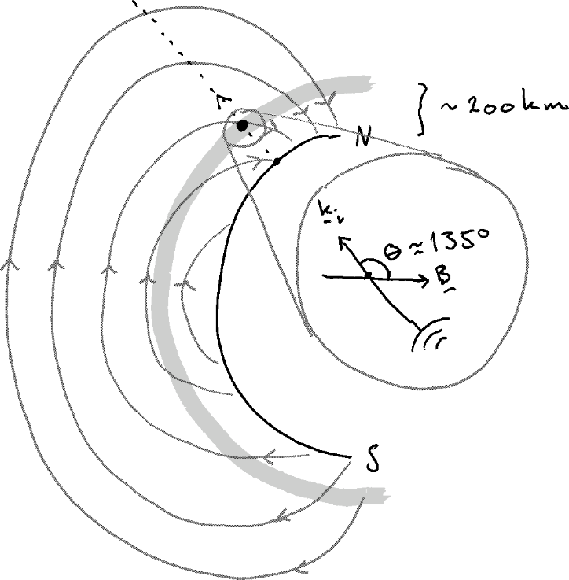

---
title:
-	"Exercise in FYS-3002 --- Solutions"
author:
-	Eirik Rolland Enger
tags:	[UiT]
date:
-	\today
geometry: margin=2.5cm
autoEqnLabels: true
numbersections: true
header-includes: |
	\usepackage{siunitx}
	\usepackage{cleveref}
output:
	pdf:document:
		templete: NULL

---

# Problems

## *Problem 1* {-}
### Task 1 {-}

> What is the physical interpretation of $\chi$ in eq.\ (3)?

Equation (3) is what is given in FH (4.35). The parameter $\chi$ describe the susceptibility of the
medium, that is, the electron population and the ion population in the plasma. When we have no
magnetic field the susceptibility is a scalar while as a magnetic field is introduced the
susceptibility is a tensor. However, only motion parallel to the applied force represents work done
on the system, so if the force is in the $z$ direction we need only one component of the tensor. The
value of $\chi$ describe how prone the medium is of being magnetized by an external magnetic field,
as such, we get information about the long term behaviour of the plasma through the susceptibility
function. The $\chi$ functions incorporate the effects of the Coulomb interactions.

### Task 2 {-}
> Explain what the term $f_{\alpha, 1}$ in eq.\ (2) describe.

This equation describe the perturbation of the phase space function and is the same as FH (4.26)
only written out in full and using the Fourier transformed spatial variable and Laplace transformed
temporal variable. 

## *Problem 2* {-}

> Using any one of the expressions for $\langle |n_\mathrm{e}(\boldsymbol{k}, \omega)|^2\rangle$,
> write a program that calculates the power spectral density. The program should accept a number of
> input parameters:
>
>> $f_\mathrm{r}$
>> : Radar frequency
>>
>> $n_\mathrm{e}$
>> : Electron number density
>>
>> $B$
>> : Magnetic field strength
>>
>> $m_\mathrm{i}$
>> : Ion mass
>>
>> $T_\mathrm{e}$
>> : Electron temperature
>>
>> $T_\mathrm{i}$
>> : Ion temperature
>>
>> $\theta$
>> : Aspect angle (the angle between the radar pointing direction and the magnetic field.)
>
> The code should be well commented and included as an appendix.

> Explain the code. Some things to consider:

> -   Where in the code were the different equations solved?
> -   How was the numerical calculation implemented? 

> The code itself should be well commented and included as an appendix.

> *Hint*: Before you integrate all the way to infinity: where along the axis of integration does
> most of the information lie?


## *Problem 3* {#prob:3 -}
> We will now look at some specific parameters using our program.
> Run your program with the parameters given as:
>
>  Parameter     |  Unit            |  Value
> :---------:    | :----:           | :-----:
> $f_\mathrm{r}$ | [$\si{\hertz}$]  | $\num{430e6}$
> $n_\mathrm{e}$ | [$\si{m^{-3}}$]  | $\num{2e10}$
> $B$            | [$\si{\tesla}$]  | $\num{3.5e-5}$
> $m_\mathrm{i}$ | [$\mathrm{amu}$] | $16$
> $T_\mathrm{e}$ | [$\si{\kelvin}$] | $200$
> $T_\mathrm{i}$ | [$\si{\kelvin}$] | $200$
> $\theta$       | [$\si{\degree}$] | $135$
> for frequencies $f\in[-\num{2e6},\num{2e6}]$.
>
> ### Task 1 {-} 
> 
> Where could an experiment with these parameters be done? Make a sketch that includes the radar
> beam and the magnetic field line. Assume that the radar points directly upwards, i.e., towards
> zenith.

The radar beam will be scattered at some height, say $h\approx \SI{200}{\kilo\metre}$. The aspect
angle is the angle between the incident wave vector and the magnetic field line at the altitude
where the radar beam is scattered.

{ width=50% }

> ### Task 2 {-}
> 
> Thespectrum is plotted for frequencies $f\in[-\num{2e6},\num{2e6}]$; relative to an observer at
> the radar location, which way does the features found at positive frequencies is the spectrum
> move?

Structures that move towards the Earth will result in structures in the power spectrum at positive
frequencies.

> ### Task 3 {-}
> 
> Plot the resulting power spectra calculated by the program and explain what the different peaks
> represent.

The plot from [problem 3](#prob:3) should result in something similar to \cref{gyrolines}.

{ width=80% }

The peaks at largest frequency represent the plasma line which describe the electron population, the
lines in the middle at frequency $f\approx\SI{0.5}{\hertz}$ are gyro lines that appear due to the
aspect angle we use (not parallel to the magnetic field line) and the lines at zero frequency are
the ion lines.

## *Problem 4* {#prob4 -}
> In this exercise we will use the parameters:
>
>  Parameter     |  Unit            |  Value
> :---------:    | :----:           | :-----:
> $f_\mathrm{r}$ | [$\si{\hertz}$]  | $\num{933e6}$
> $n_\mathrm{e}$ | [$\si{m^{-3}}$]  | $\num{2e11}$
> $B$            | [$\si{\tesla}$]  | $\num{5e-5}$
> $m_\mathrm{i}$ | [$\mathrm{amu}$] | $16$
> $T_\mathrm{i}$ | [$\si{\kelvin}$] | $2000$
> $\theta$       | [$\si{\degree}$] | $180$
> 
> ### Task 1 {-}
>
> Calculate the power spectral density on $f\in[\num{3.5e6},\num{7e6}]$ for
> $T_\mathrm{e}=\SI{2000}{\kelvin},\,\SI{4000}{\kelvin},\,\SI{6000}{\kelvin},$ and
> $\SI{8000}{\kelvin}$ and plot the power spectra.

The plots from the above should look similar to \cref{fig:temp_change}.

. \label{fig:temp_change}](temps.pdf)

> ### Task 2 {-}
> 
> Explain the changes that can be seen as the electron temperture changes.

This is showing the upshifted plasma line.
The equation describing the real part of the plasma line wave resonance frequency is 
$$
\omega_{\Re,\mathrm{e}}=[\omega_{p\mathrm{e}}^2(1+3k^2\lambda_\mathrm{D}^2)+\Omega_\mathrm{e}^2\sin^2\theta]^{1/2}=[\omega_{p\mathrm{e}}^2+3k^2
v_\mathrm{th,e}^2+\Omega_\mathrm{e}^2\sin^2\theta]^{1/2}
$$
and we see that with increasing temperature the thermal velocity will increase, thus increasing the
resonance frequency as seen in the \cref{fig:temp_change}.

> ### Task 3 {-}
>
> Explain what the assumption $k^2\lambda_\mathrm{D}^2\ll 1$ is referring to. Is this assumption
> valid for all temperatures? Why/why not?

We also see from the figure that the width of the plasma line gets wider as the temperature is
increased. The assumption $k^2\lambda_\mathrm{D}^2\ll 1$ is usually applied when solving the IS
spectrum, implying weak Landau damping. It describe the kind of scattering we are interested in,
which is scattering from the larger structures with length scale equal to the Debye length. But with
increasing temperature this assumption is no longer valid (the Debye length is proportional to the
square root of the temperature) and the Landau damping gets stronger. More power is distributed to
the shoulders and therefore the peak power is also decreased to maintain the same power of the
plasma line for all temperatures.

## *Problem 5* {#prob5 -}

> You should now be able to experiment a bit for yourself.

> ### Task 1 {-}
>
> Explain which parameter(s) that needs to be changed to obtain a similar plot as is shown in
> \cref{fig:ionlines}.

We recognize this as the same as the plot in the compendium by Bjørnå (last page, top panel). If we
change the ion temperature and keep the ratio between ion and electron temperature the same we get
the desired result. Specifically, we can use $T_\mathrm{i}=100, 200, 300, 400\,\mathrm{K}$ and
a ratio to electron temperature given as $T_\mathrm{e}/T_\mathrm{i}=1.5$.

>
> ### Task 2 {-}
>
> Reproduce the plot in \cref{fig:ionlines} using your own program. Include values on the axis and
> labels to all spectra.
>
> { width=80% }

\pagebreak

\appendix

# Appendix

## Main program

`isr.py` solves the incoherent scatter spectrum.

```{#main .python .numberLines include=isr.py}
```

## Solutions script

The script `soln.py` uses `isr.py` with different input parameters and solves the problems / creates
the plots seen in all exercises.

```{#soln .python .numberLines include=soln.py}
```
