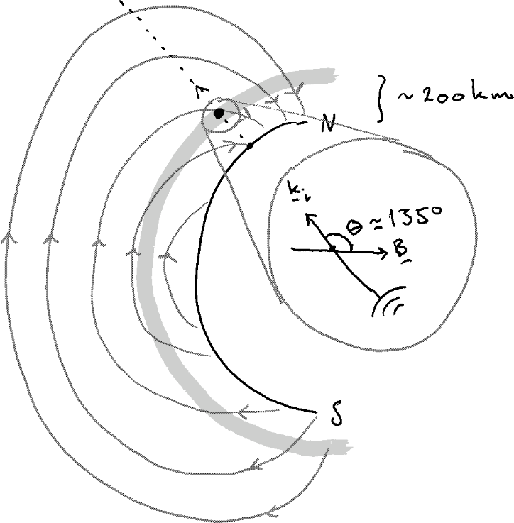

---
title:
-	"Exercise in FYS-3002 --- Solutions"
author:
-	Eirik Rolland Enger
tags:	[UiT]
date:
-	\today
geometry: margin=2.5cm
autoEqnLabels: true
numbersections: true
header-includes: |
	\usepackage{siunitx}
	\usepackage{cleveref}
abstract: |
	Solve all tasks.

	Include code listing as an appendix.
output:
	pdf:document:
		templete: NULL

---

## TODO: {-}
-	Split into subtasks
-	Guide through the necessary theory
-	Make a verbose implementation / solution to the problem with plots
-	Find interesting physical parameters they should test and explain what it all means.

\pagebreak

# Solving the equation for the ISR spectrum
> Following @Farley1999. Equations from @Farley1999 are written FH (xx).

We are going to derive the equation for the power spectral density of the electron number density, namely the expression

$$
\langle |n_\mathrm{e}(\boldsymbol{k}, \omega)|^2\rangle=\frac{n_{\mathrm{e},0}}{\pi\omega}\frac{
\Im\{F_\mathrm{e}\}|1+\chi_\mathrm{i}|^2+\Im\{F_\mathrm{i}\}|\chi_\mathrm{e}|^2
}{
|1+\chi_\mathrm{e}+\chi_\mathrm{i}|^2
}.
$$ {#eq:electron_number_density}

## Vlasov's equation
Let us start from the Vlasov's equation.
This is similar to the Boltzmann equation, but we omit the collision term.
The Vlasov equation can be written as (FH 4.24)
$$\partial_t f + \boldsymbol{v}\cdot \partial_{\boldsymbol{r}}f+\mu_\alpha [\boldsymbol{E}+\boldsymbol{v}\times\boldsymbol{B}]\cdot\partial_{\boldsymbol{v}}f=0
$$
where $f=f(\boldsymbol{r},\boldsymbol{v},t)$ describe the phase space, $\mu_\alpha$ is the charge-to-mass ratio of particle species $\alpha$ and $\boldsymbol{E}$ and $\boldsymbol{B}$ are the electric and magnetic fields, both functions of space and time.

Let us assume all parameters to consist of a linear term and a higher order term, that is, we assume all parameters are on the form $f=f_0[1+f_1]$ where $f_0$ is linear and $f_1$ is non-linear and that $f_1 \ll 1$.
Let us also write up the Fourier transform and Laplace transform of $f_1$:
$$
\begin{aligned}
f_1(\boldsymbol{r},\boldsymbol{v},t)&=\sum_{\boldsymbol{k}} f_1(\boldsymbol{k},\boldsymbol{v},t)\exp(-i\boldsymbol{k}\cdot\boldsymbol{r})\\
f_1(\boldsymbol{k},\boldsymbol{v},s)&=\int_0^\infty f_1(\boldsymbol{k},\boldsymbol{v},t)\exp(-st)\mathrm{d}t
\end{aligned}
$$
We linearize the Vlasov equation and obtain
$$
sf_1(\boldsymbol{k},\boldsymbol{v},s)-f_1(\boldsymbol{k},\boldsymbol{v},t=0)-i\boldsymbol{k}\cdot \boldsymbol{v}f_1(\boldsymbol{k},\boldsymbol{v},s)+\mu_\alpha\left[ \frac{1}{f_0(\boldsymbol{v})}\boldsymbol{E}\cdot\partial_{\boldsymbol{v}}f_0(\boldsymbol{v})-\boldsymbol{B}[\boldsymbol{v}\times\partial_{\boldsymbol{v}}f_1(\boldsymbol{k},\boldsymbol{v},s)] \right]=0
$$
It can be shown that this has solution
$$
f_{\alpha,1}(\boldsymbol{k},\boldsymbol{v},s)
=\frac{1}{\mu_\alpha B}
\int_{-\infty}^\varphi g_\alpha (\varphi, \varphi')
\left\{
f_{\alpha,1}(\boldsymbol{k},\boldsymbol{v}',t=0)\mp \frac{i2X_\mathrm{p}^2}{f_{\alpha,0}(\boldsymbol{v}')}\boldsymbol{k}\cdot\boldsymbol{v}'[Zn_\mathrm{i}(\boldsymbol{k},s)-n_\mathrm{e}(\boldsymbol{k},s)]
\right\}
\mathrm{d}\varphi'
$$
This equation describe the perturbation of the phase space function and is the same as FH (4.26) only written out in full and using the Fourier transformed spatial variable and Laplace transformed temporal variable. The primes (e.g. on $\boldsymbol{v}'$) refer to terms on the *unperturbed* orbit. Specifically we have that the unperturbed velocity is
$$
\boldsymbol{v}'=\mathbf{e}_1 w\cos\varphi'+\mathbf{e}_2 w\sin\varphi'+\mathbf{e}_3 u
$$
and we see that the velocity is a function of the variable $\varphi$ (i.e., $f_1(\boldsymbol{k},\boldsymbol{v},s)=f_1(\boldsymbol{k},w,u,\varphi,s)$). $g(\varphi,\varphi')$ can be seen as an integrating factor [@Bernstein1958].

Density perturbations can then be obtained by integration:
$$
n_\alpha(\boldsymbol{k},s)=\int f_{\alpha,0}(\boldsymbol{v}')f_{\alpha,1}(\boldsymbol{k},\boldsymbol{v},s)\mathrm{d}\boldsymbol{v}
=n_{\alpha,0}\int f_{\alpha,1}(\boldsymbol{k},\boldsymbol{v},s)\mathrm{d}\boldsymbol{v}
$$

## Electron number density
The function $F_\alpha$ is defined as
$$
\begin{aligned}
F_\alpha(\boldsymbol{k},\omega)
&=1+i\omega\int_0^\infty \exp\left\{
i\omega \tau-\frac{k_\mathrm{r}^2 T_\alpha k_\mathrm{B}\sin^2\theta}{m_\alpha\Omega_\alpha^2}[1-\cos(\omega \tau)]-\frac{1}{2}(k_\mathrm{r}\tau\cos\theta)^2\frac{T_\alpha k_\mathrm{B}}{m_\alpha}
\right\}\mathrm{d}\tau\\
&=1+i\omega G_\alpha(\boldsymbol{k},\omega)
\end{aligned}
$$
The integral $G_\alpha(\boldsymbol{k},\omega)$ is often referred to as a Gordeyev integral. Another useful parameter is:
$$
\chi_\alpha(\boldsymbol{k},\omega)=\frac{1}{k^2\lambda_\mathrm{D}^2}F_\alpha(\boldsymbol{k},\omega)=\frac{1}{(k\lambda_\mathrm{D})^2}[1+i\omega G_\alpha(\boldsymbol{k},\omega)]
$${#eq:chi}

Using our definitions of $F_\alpha$ and $\chi_\alpha$ we can now readily compute the IS spectrum from eq. (@eq:electron_number_density):
$$
\langle |n_\mathrm{e}(\boldsymbol{k}, \omega)|^2\rangle=\frac{n_{\mathrm{e},0}}{\pi\omega}\frac{
\Im\{F_\mathrm{e}\}|1+\chi_\mathrm{i}|^2+\Im\{F_\mathrm{i}\}|\chi_\mathrm{e}|^2
}{
|1+\chi_\mathrm{e}+\chi_\mathrm{i}|^2
}.
$${#eq:number_density_2}
We may also rewrite the above using that $\Im\{F_\alpha\}=\omega G_\alpha$:
$$
\langle |n_\mathrm{e}(\boldsymbol{k}, \omega)|^2\rangle=\frac{n_{\mathrm{e},0}}{\pi}\frac{
G_\mathrm{e}|1+\chi_\mathrm{i}|^2+G_\mathrm{i}|\chi_\mathrm{e}|^2
}{
|1+\chi_\mathrm{e}+\chi_\mathrm{i}|^2
}.
$${#eq:number_density_3}

# Problems
## *Problem 1* {-}
> What is the physical interpretation of $\chi$ in eq.\ (@eq:chi)?

Equation (@eq:chi) is what is given in FH (4.35).
The parameter $\chi$ describe the susceptibility of the medium, that is, the electron population and the ion population in the plasma.
In this context the susceptibility is a scalar and its value describe how prone the medium is of being magnetized by an external magnetic field, as such, we get information about the long term behaviour of the plasma through the susceptibility function.

## *Problem 2* {-}
> Using any one of the expressions for $\langle |n_\mathrm{e}(\boldsymbol{k}, \omega)|^2\rangle$, write a program that calculates the power spectral density. This should accept a number of input parameters:
>
>> $f_\mathrm{r}$
>> : Radar frequency
>>
>> $n_\mathrm{e}$
>> : Electron number density
>>
>> $B$
>> : Magnetic field strength
>>
>> $m_\mathrm{i}$
>> : Ion mass
>>
>> $T_\mathrm{e}$
>> : Electron temperature
>>
>> $T_\mathrm{i}$
>> : Ion temperature
>>
>> $\theta$
>> : Aspect angle (the angle between the radar pointing direction and the magnetic field.)
>
> The code should be well commented and included as an appendix.

## *Problem 3* {#prob:3 -}
> We will now look at some specific parameters using our program. Run your program with the parameters given as:
>
>  Parameter     |  Unit            |  Value
> :---------:    | :----:           | :-----:
> $f_\mathrm{r}$ | [$\si{\hertz}$]  | $\num{430e6}$
> $n_\mathrm{e}$ | [$\si{m^{-3}}$]  | $\num{2e10}$
> $B$            | [$\si{\tesla}$]  | $\num{3.5e-5}$
> $m_\mathrm{i}$ | [$\mathrm{amu}$] | $16$
> $T_\mathrm{e}$ | [$\si{\kelvin}$] | $200$
> $T_\mathrm{i}$ | [$\si{\kelvin}$] | $200$
> $\theta$       | [$\si{\degree}$] | $135$
> for frequencies $f\in[-\num{2e6},\num{2e6}]$.
>
> ### Task 1 {-}
> Where could an experiment with these parameters be done? Make a sketch that includes the radar beam and the magnetic field line. Assume that the radar points directly upwards, i.e., towards zenith.
> 
> ### Task 2 {-}
> The spectrum is plotted for frequencies $f\in[-\num{2e6},\num{2e6}]$; relative to an observer at the radar location, which way does the features found at positive frequencies is the spectrum move?
>
> ### Task 3 {-}
> Plot the resulting power spectra calculated by the program and explain what the different peaks represent.

The radar beam will be scattered at some height, say $h\approx \SI{200}{\kilo\metre}$. The aspect angle is the angle between the incident wave vector and the magnetic field line at the altitude where the radar beam is scattered.

{ width=50% }

The plot from [problem 3](#prob:3) should result in something similar to \cref{gyrolines}.

{ width=80% }

## *Problem 4* {#prob4 -}
> In this exercise we will use the parameters:
>
>  Parameter     |  Unit            |  Value
> :---------:    | :----:           | :-----:
> $f_\mathrm{r}$ | [$\si{\hertz}$]  | $\num{933e6}$
> $n_\mathrm{e}$ | [$\si{m^{-3}}$]  | $\num{2e11}$
> $B$            | [$\si{\tesla}$]  | $\num{5e-5}$
> $m_\mathrm{i}$ | [$\mathrm{amu}$] | $16$
> $T_\mathrm{i}$ | [$\si{\kelvin}$] | $2000$
> $\theta$       | [$\si{\degree}$] | $180$
> Calculate the power spectral density on $f\in[\num{3.5e6},\num{7e6}]$ for $T_\mathrm{e}=\SI{2000}{\kelvin},\,\SI{4000}{\kelvin},\,\SI{6000}{\kelvin},$ and $\SI{8000}{\kelvin}$.
>
> ### Task 1 {-}
> Explain the changes that can be seen as the electron temperture changes.

The plots from the above should look similar to \cref{fig:temp_change}.

. \label{fig:temp_change}](temps.pdf)

This is showing the upshifted plasma line. The equation describing the real part of the plasma line wave resonance frequency is
$$
\omega_{\Re,\mathrm{e}}=[\omega_{p\mathrm{e}}^2(1+3k^2\lambda_\mathrm{D}^2)+\Omega_\mathrm{e}^2\sin^2\theta]^{1/2}=[\omega_{p\mathrm{e}}^2+3k^2 v_\mathrm{th,e}^2+\Omega_\mathrm{e}^2\sin^2\theta]^{1/2}
$$
and we see that with increasing temperature the thermal velocity will increase, thus increasing the resonance frequency as seen in the \cref{fig:temp_change}.

We also see from the figure that the width of the plasma line gets wider (more damped) as the temperature is increased. The assumption $k^2\lambda_\mathrm{D}^2\ll 1$ is usually applied when solving the IS spectrum, implying weak Landau damping. But with increasing temperature this assumption is no longer valid and the Landau damping gets stronger. More power is distributed to the shoulders and therefore the peak power is also decreased to maintain the same power of the plasma line for all temperatures.

# Appendix {-}
```{#main .python .numberLines}
#!/home/een023/.virtualenvs/py3.9/bin/python

import sys
import numpy as np
import scipy.constants as const
import scipy.integrate as si
import matplotlib.pyplot as plt

import config as cf


def isr():
    # Set physical parameters
    f = cf.f  # 1/s ~ radar frequency
    T_e = cf.T_e  # K ~ electron temperature
    T_i = cf.T_i  # K ~ ion temperature
    n_e = cf.n_e  # 1/m^3 ~ electron number density
    B = cf.B  # T ~ magnetic field strength (towards Earth)
    aspect = cf.aspect  # degree ~ radar pointing direction to magnetic field line
    aspect = np.pi / 180 * aspect
    M_amu = cf.M  # amu ~ ion mass
    M = M_amu * (const.m_p + const.m_n) / 2  # Convert to kg
    nu = cf.nu  # 1/s ~ collision frequency

    # Calculate constants
    k = - 4 * np.pi * f / const.c
    l_D = debye(T_e, n_e)
    w_c = gyro('e', B)
    W_c = gyro('i', B, M_amu)

    # Susceptibility
    f_ax = np.linspace(- 1e4, 1e4, cf.N_F)  # Frequency axis
    # Integration variable of Gordeyev
    y_e = np.linspace(0, 1.5e-4**(1 / cf.ORDER), cf.N_Y)**cf.ORDER
    y_i = np.linspace(0, 1.5e-2**(1 / cf.ORDER), cf.N_Y)**cf.ORDER
    G_e = maxwellian_integrand(y_e, nu, k, aspect, T_e, w_c, const.m_e)
    G_i = maxwellian_integrand(y_i, nu, k, aspect, T_i, W_c, M)
    Fe = F(f_ax, y_e, nu, G_e)
    Fi = F(f_ax, y_i, nu, G_i)

    Xp = (1 / (2 * l_D**2 * k**2))**(1 / 2)
    chi_e = 2 * Xp**2 * Fe
    chi_i = 2 * Xp**2 * Fi

    with np.errstate(divide='ignore', invalid='ignore'):
        IS = n_e / (np.pi * 2 * np.pi * f_ax) * \
                (np.imag(Fe) * np.abs(1 + chi_i)**2 + np.imag(Fi) * np.abs(chi_e)**2) / \
                (np.abs(1 + chi_e + chi_i)**2)
    
    return f_ax, IS

def F(f_ax, y, nu, G):
    # Calculate the F functions that include susceptibility
    a = np.array([])
    for f in f_ax:
        w = 2 * np.pi * f
        sint = my_integration_method(w, y, G)
        a = np.r_[a, sint]
    
    func = 1 + (1j * 2 * np.pi * f_ax + nu) * a
    return func

def maxwellian_integrand(y, nu, k, aspect, T, w_c, m):
    G = np.exp(- y * nu -
            k**2 * np.sin(aspect)**2 * T * const.k /
            (m * w_c**2) * (1 - np.cos(w_c * y)) -
            .5 * (k * np.cos(aspect) * y)**2 * T * const.k / m) 

    return G

def my_integration_method(w, y, G):
    val = np.exp(1j * w * y) * G
    sint = si.simps(val, y)
    return sint

def debye(T, n):
    ep0 = 1e-9 / 36 / np.pi
    l_D = (ep0 * const.k * T / (n * const.e**2))**(1 / 2)
    return l_D

def gyro(p, B, m=16):
    if p == 'e':
        w = const.e * B / const.m_e
    elif p == 'i':
        w = const.e * B / (m * (const.m_p + const.m_n) / 2)
    else:
        sys.exit(f'I do not know what kind of particle {p} is.')
    return w

def plot():
    x, y = isr()
    # y = 10 * np.log10(y)

    plt.figure()
    plt.plot(x, y)
    plt.grid(alpha=0.4)
    plt.show()

if __name__ == '__main__':
    plot()
```

# References

